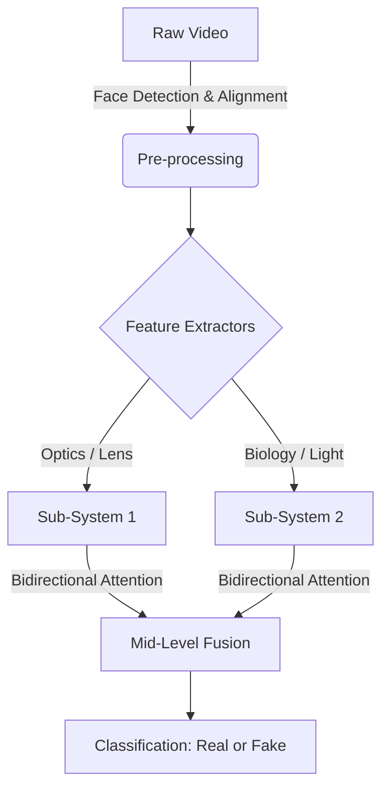
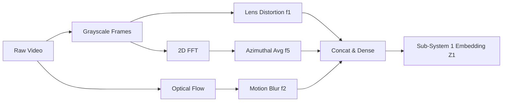
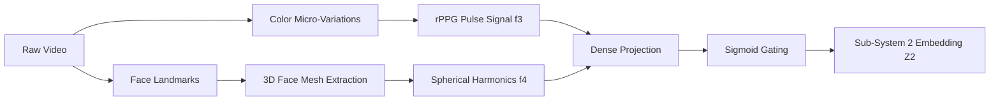
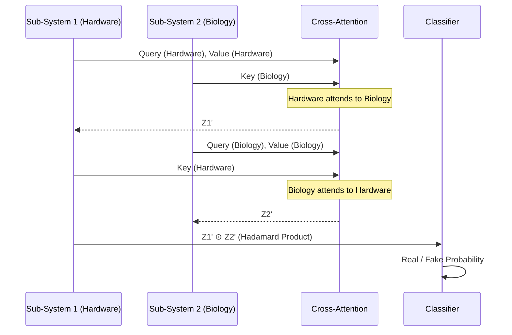

# Physics-Based Deepfake Detector 🔍

A robust, multi-modal deepfake detection framework that leverages physical and biological inconsistencies to distinguish between real and AI-generated (manipulated) videos. Unlike traditional CNNs that look for pixel-level artifacts, this system models the **physics of the camera** (optics) and the **biology of the human** (biomechanics) to find deepfakes that appear visually flawless.

---

## 🚀 Getting Started

### 1. Prerequisites
Ensure you have Python 3.9+ installed on your system. It is highly recommended to use a virtual environment.

### 2. Installation
Install the required dependencies using pip:
```bash
pip install -r requirements.txt
```
*(Dependencies include TensorFlow, OpenCV, MediaPipe, NumPy, SciPy, and Scikit-Learn).*

### 3. Running the Pipeline

**Step 1: Feature Extraction (Optional but recommended for faster training)**
If you are training on a large dataset like FaceForensics++, you can pre-extract the physical and biological features to `.npz` files:
```bash
python pipelines/extract_features.py
```
*Note: If you have two versions of features (e.g., `features` and `features_v2`), you can configure the target directory in `config/default_config.yaml`.*

**Step 2: Train Individual Sub-Systems**
You can pre-train the individual encoders before fusion to stabilize the network:
```bash
python pipelines/train_subsystem1.py
python pipelines/train_subsystem2.py
```

**Step 3: Train Master Fusion Model**
Once the sub-systems are trained, you can train the Mid-Level Fusion model:
```bash
python pipelines/train_fusion_1_2_mid.py
```
*(Alternatively, train the end-to-end Master model using `python pipelines/train_master.py`)*

**Step 4: Evaluate and Test**
To run cross-dataset evaluations (e.g., on Celeb-DF) and generate metrics (Accuracy, AUC, F1) alongside Confusion Matrices and ROC curves:
```bash
python eval_celebdf.py --data_dir "DataSets/Celeb-DF-v2"
```

To run an automated benchmark suite across all your models and feature sets:
```bash
python run_all_experiments.py
```

---

## 🧠 How It Works

The core philosophy of this project is that while Deepfakes can easily fool the human eye by generating realistic textures, they consistently fail to replicate **authentic real-world physics**. We capture this through two dedicated sub-systems.



### 📷 Sub-System 1: Hardware Optics
This system looks at how the physical camera lens and sensor interacted with the scene. Deepfakes generated by GANs/Diffusion models often lack these physical signatures.

1. **Lens Distortion ($f_1$)**: Analyzes geometric distortion (radial/tangential) caused by physical camera lenses.
2. **Motion Blur ($f_2$)**: Extracts Farneback optical flow and compares it against object movement to detect synthetic or missing motion blur.
3. **Frequency Spectrum ($f_5$)**: Computes the 2D FFT (Fast Fourier Transform) azimuthal average to find high-frequency artifacts left behind by upsampling layers in deepfake generators.



### 🫀 Sub-System 2: Biological Domain
This system analyzes the physiological signals of the human subject in the video.

1. **Biomechanics / rPPG ($f_3$)**: Extracts remote photoplethysmography (rPPG) signals by tracking micro-color variations in the face caused by blood flow and heartbeat. Deepfakes often lack a consistent, biological pulse.
2. **Lighting Spherical Harmonics ($f_4$)**: Estimates the 3D lighting environment (Spherical Harmonics) hitting the face. Deepfakes frequently stitch faces onto target bodies without matching the ambient lighting environment correctly.



---

## 🔗 Mid-Level Fusion Architecture

Rather than just combining the final predictions (Late Fusion), this project utilizes **Mid-Level Fusion via Bidirectional Cross-Attention**.

1. The hardware features ($f_1, f_2, f_5$) are embedded into a unified space $Z_1$.
2. The biological features ($f_3, f_4$) are embedded into a unified space $Z_2$.
3. $Z_1$ attends to $Z_2$ (asking: "Does the lighting match the lens distortion?").
4. $Z_2$ attends to $Z_1$ (asking: "Does the motion blur align with the biological heartbeat movement?").
5. The representations are merged using a Hadamard product and passed through a shared MLP bottleneck for final classification.



---

## 🔮 Future Improvements

- **Temporal Sequence Modeling**: Currently, features are averaged or aggregated over frames. Implementing an LSTM or Transformer-based sequence processor could capture the temporal degradation of deepfakes over time.
- **Audio-Visual Sync (Sub-System 3)**: Deepfakes frequently suffer from micro-desyncs between lip movement and audio phonemes. Integrating MFCC audio features would provide a powerful third pillar.
- **Dynamic Feature Selection**: Introducing a gating mechanism that dynamically weights Sub-System 1 vs. Sub-System 2 depending on the compression level of the video (e.g., relying more on biology if heavy compression destroys lens artifacts).
